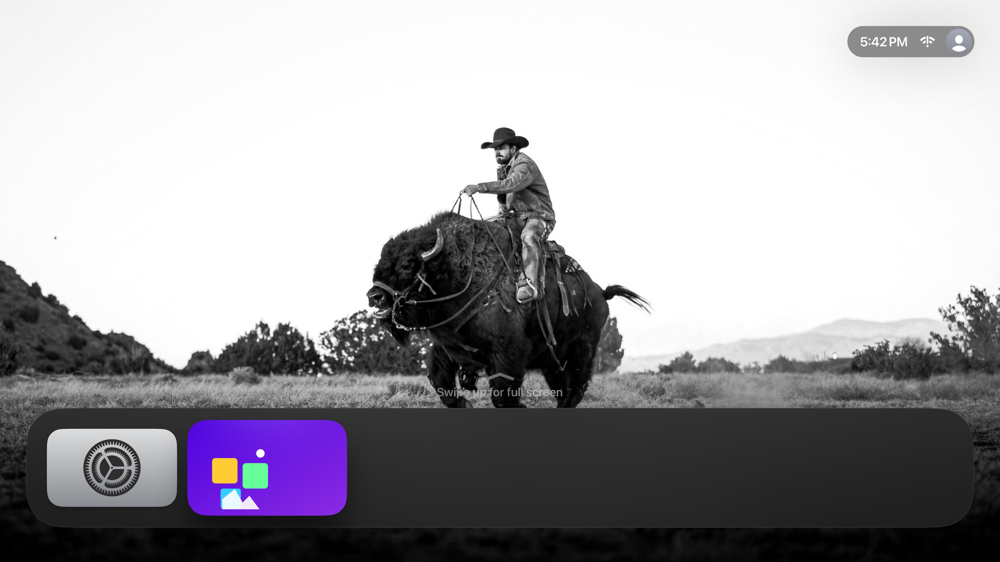

  

> **This project needs your help.** Immich Gallery is built and maintained in my spare time. Your support helps cover ongoing development and App Store costs. [Support the project](https://www.buymeacoffee.com/zzpr69dnqtr) or [see project finances](https://mensadilabs.github.io/Immich-Gallery/#finances).

 

# Immich Gallery for Apple TV

Bring your Immich photo library to the biggest screen in your home.

Immich Gallery is a native Apple TV app for browsing, searching, and enjoying your self-hosted photo library from the comfort of your couch.

**Beautiful full-screen slideshow mode with customizable playback options** makes it easy to relive family memories, share vacation photos, or turn your television into an ambient display during gatherings.

## Screenshots

<table>
  <tr>
    <td></td>
    <td></td>
  </tr>
  <tr>
    <td></td>
    <td></td>
  </tr>
  <tr>
    <td></td>
    <td></td>
  </tr>
  <tr>
    <td></td>
    <td></td>
  </tr>
  <tr>
    <td></td>
    <td></td>
  </tr>
  <tr>
    <td></td>
    <td></td>
  </tr>
</table>

## Features

- **Slideshow Mode**: Beautiful full-screen slideshow mode with customizable playback options, timing, transitions, and optional overlays
- **Photo Grid View**: Browse your entire library in a fast, infinite-scrolling grid
- **People Recognition**: Jump straight to people Immich detects in your photos
- **Albums**: Browse personal and shared Immich albums
- **Tags and External Folders**: Browse tags with animated thumbnails and view external library folders
- **Search and Filters**: Find photos using Immich content search, locations, dates, and metadata
- **Explore**: Discover statistics, locations, and highlights from your library
- **Top Shelf**: Choose featured or random photos for the Apple TV Top Shelf
- **Multiple Accounts**: Store multiple Immich accounts and switch between servers
- **Flexible Authentication**: Sign in with a password or Immich API key
- **EXIF Data**: Inspect camera details and location metadata

## Private by Design

Your photos stay on your own Immich server. Immich Gallery connects directly to your existing Immich instance and does not upload, store, or process your photo library on third-party servers. The app includes zero telemetry.

Immich Gallery is an independent client for Immich and is not affiliated with or endorsed by the Immich project.

## Requirements

- Apple TV (4th generation or later)
- tvOS 15.0+
- Immich server running and accessible
- Network connectivity between Apple TV and Immich server

## Quick Start

1. **Launch the app** - You'll be prompted to sign in to your Immich server
2. **Enter credentials** - Provide the server URL (e.g., `https://your-immich-server.com`) plus either email & password or an Immich API key
3. **Browse your photos** - Navigate using the Apple TV remote or Siri Remote

> [!NOTE]
>
> - Stuck on "Data couldn't read because its missing"? Update Immich and retry: https://github.com/mensadilabs/Immich-Gallery/issues/67
> - OAuth / OIDC sign-in needs server-side changes (tracked in https://github.com/mensadilabs/Immich-Gallery/issues/77). Use an Immich API key instead.
> - FaceID / PIN locking is currently out of scope. https://github.com/mensadilabs/Immich-Gallery/issues/64

## API Key Permissions

See the [Immich Gallery API key permissions guide](https://mensadilabs.github.io/Immich-Gallery/api-key-permissions/) for the exact scoped permissions required for complete app functionality.

## Stats

